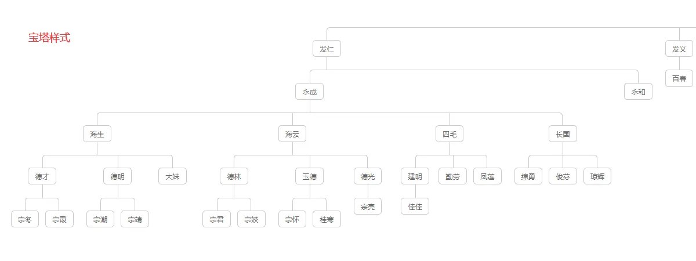
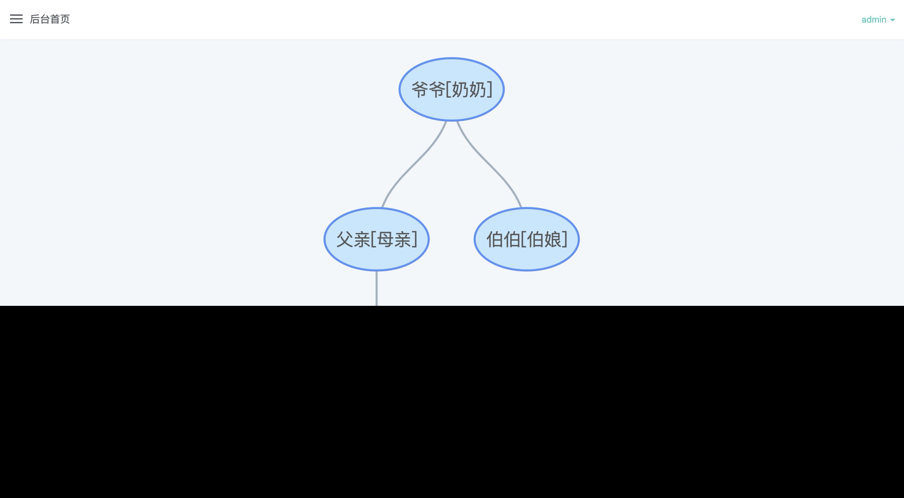
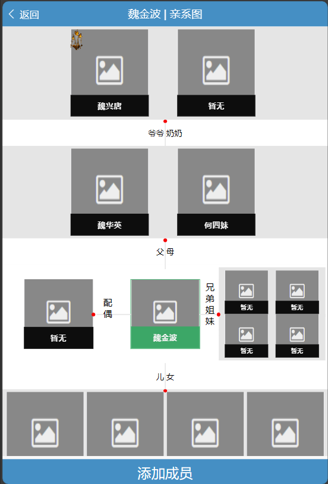
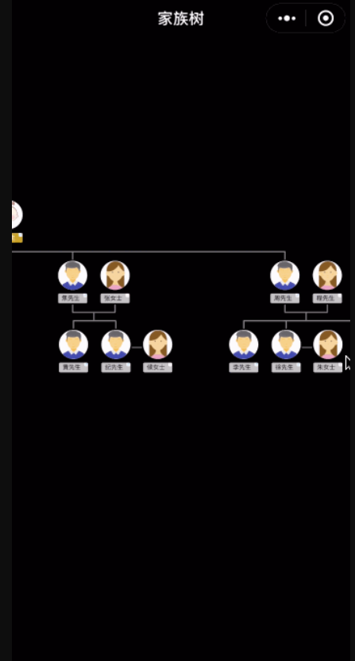
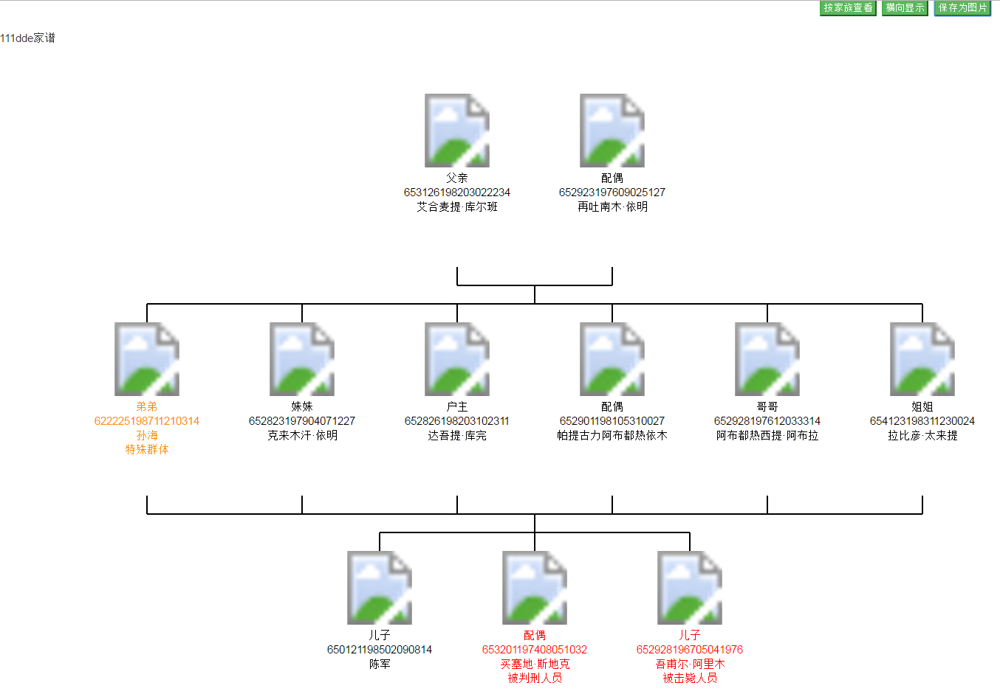
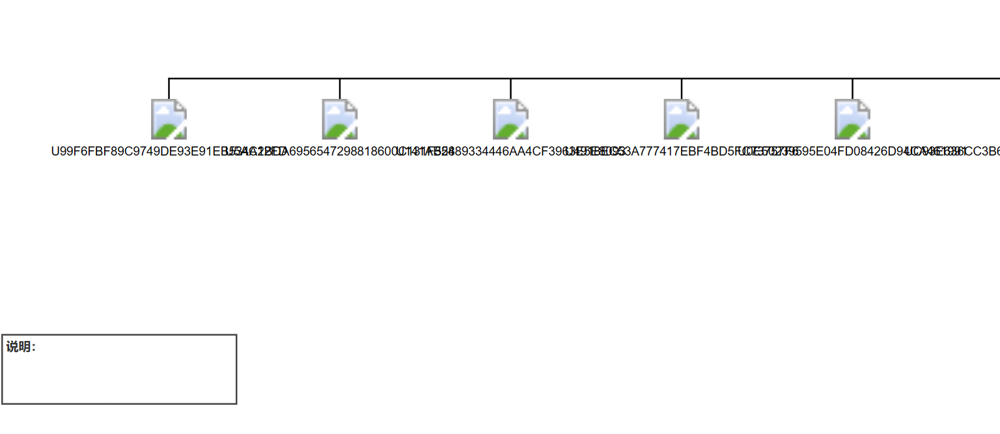
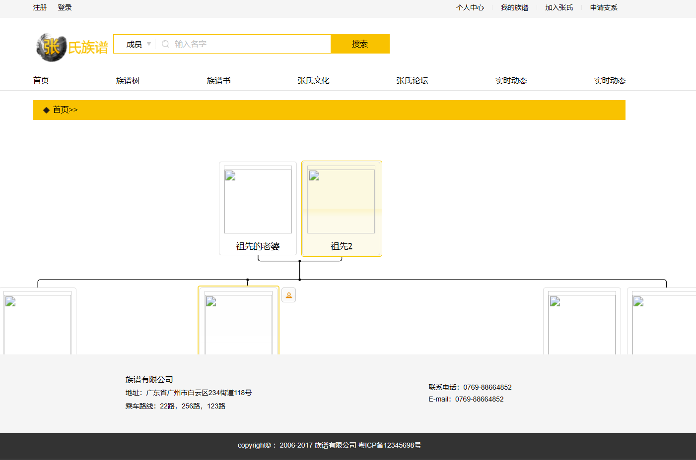
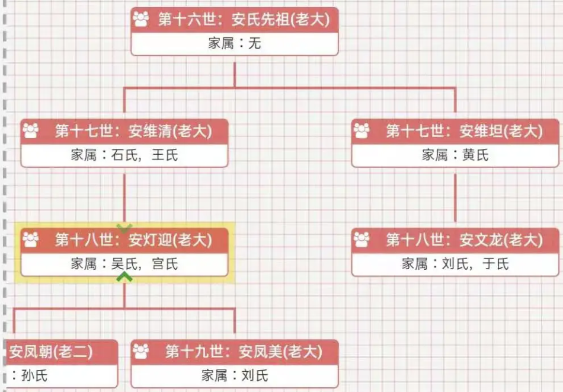
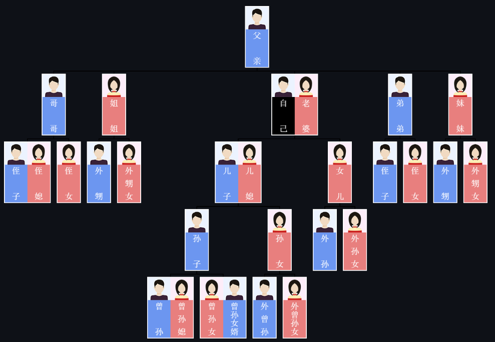

## https://github.com/jiehu0992/5itv
- familytree家谱宗谱族谱 刘三才族裔刘氏族谱网源码
  
- 九成代码使用PHP编写

## https://github.com/GodLikeZeal/family
- 家族族谱，族谱树管理后台系统
  
- docker/MongoDB

## https://github.com/771534408/familyTree ★
- 族谱app功能包含（成员的录入，族谱的介绍，家谱亲系图，族谱联系人，电子墓园）等五大部分构成，功能待完善中,项目基于ionic1.x版本进行开发。
  
- 纯js，能运行，估计不好改
  

## https://github.com/Monkiki920/TreeChart
- 微信小程序实现的族谱图
  
- 需要微信小程序的开发环境

## https://github.com/zhangchan/genogram
- 家族图谱
  
- 实际运行结果如下，（使用js开发，十分简陋）：
  

## https://github.com/Fore2018/MyFamilyTree
- 我家族谱——家族族谱管理系统
- 使用Python+php开发，劝退

## https://github.com/IanHJW/forever
- 家族族谱项目
- 使用jsp开发

## https://github.com/lothar-org/op_pedigree
- 族谱网
- 使用PHP开发

## https://github.com/waitatlee/familybook
- 汗青族谱系统,家族脉络,一目了然
- 使用PHP开发，README为英文

## https://github.com/Houshion/dzzp
- 某大户人家电子族谱
- 前端空壳
  

## https://github.com/sdzhongqian/qingfeng-gen
- 基于springboot、orgtree的家谱树管理系统，将纸质版的家谱进行电子化、信息化，建立家族的家谱血脉联系。
  
- 项目打的是war包，而且应用了jsp，数据库为mysql5

## https://github.com/Junhong-Chen/Canvas-OrgChart
- 使用 canvas 绘制组织架构图/族谱图
  
- 纯js，运行结果与readme不符

